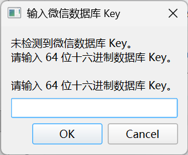
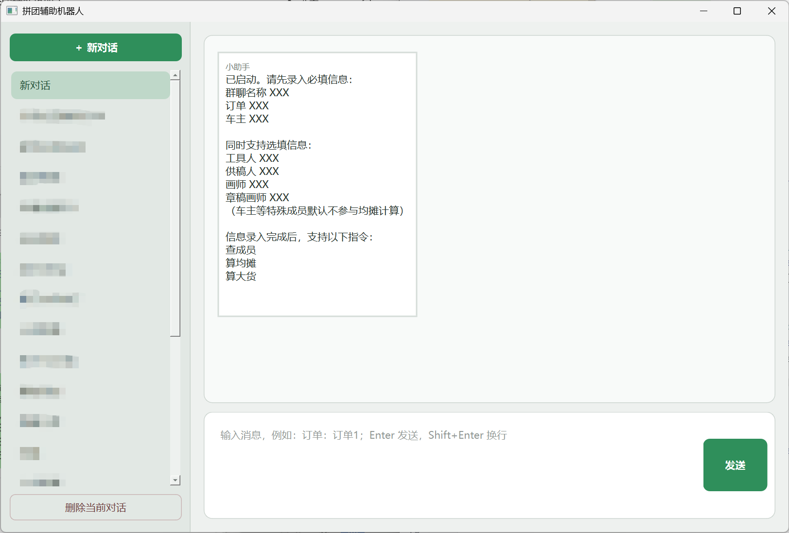

# 无盈利拼团小助手 Group-Buying-Assistant

这是一个用于金属徽章无盈利拼团的程序，目的是帮助车主核对成员、计算均摊、计算大货。

当前版本：0.4.0_beta

写给我的朋友麦乐鸡，祝你别再捅娄子（）

## 📖 使用说明

### Step0. 数据库密钥输入

初次运行程序时，会弹出要求用户输入 key 的窗口。可以使用 wx_key 等工具获取文字 key 之后输入。（**如果使用 wx_key，请确保程序路径为纯英文**，否则 wx_key 会闪退。不需要图像 key。）

输入过的 key 会本地缓存，解密的数据库信息也缓存在本地。输入一次key之后，同一账号在同一设备上，（在wx大版本更新前，应该）不需要再次输入 key。但是更换账号或者更换设备后，需要重新获取 key 并输入。

**补充说明：**

key 是微信数据库解密密钥，用于解析聊天记录。需要注意的是，在目前的微信版本，程序不支持自动解码微信本地数据库，且可以自动解码的微信版本已无法使用安装包进行安装。因此，如果要使用本程序，需要用户自行获取 key 并主动输入。

**本程序只会在你的授权下访问你自己的微信本地数据库，不会把你的数据上传至互联网。如果有对数据泄露或封号的担忧，请勿使用本程序。使用前请务必知悉。**

### Step1. 待处理信息录入

程序启动后，会显示如上界面。每一个对话会被当成一车，对话会按照创建时间进行排序，对话记录会在本地保存。

**点击新对话之后，需要输入以下信息：**

1️⃣**群聊名称**：输入车群名称。群聊支持模糊检索，并且后续再次录入时可以修改。建议输得尽量准确，避免名称有相同词语的群聊被错误识别。

群聊名称输入后，当前对话会显示群聊名称。

> 输入示例1：群聊 一家人，订单 yjr
>
> 输入示例2：群聊 相亲相爱一家人

**2️⃣订单**：用于查群成员昵称是否备注正确、以及计算均摊的订单。

目前，**需要把自助拼单的订单文件上传至程序根目录的 orders 文件夹内**（建议重命名为简单的名称）。下载下来的.xlsx文件直接导入即可。输入订单名称时可以不需要输入.xlsx后缀。

也可以自定义文件输入输出路径，但是并不推荐。这个暂未经过完整测试，运行中可能会出现大量的错误。

### Step2. 特殊成员名单输入

> 输入示例 1：车主 xxx，单号 7，参摊
>
> 输入示例 2：画师 xxx
>
> 输入示例 3：车主 xxx，工具人 xxx

特殊成员名单支持：

| 特殊成员 | 人数限制        | 是否必须设置 |
| -------- | --------------- | ------------ |
| **车主** | 必须且只能 1 人 | **必须**     |
| 画师     | 最多 1 人       | 可选         |
| 章稿画师 | 最多 1 人       | 可选         |
| 供稿人   | 最多 1 人       | 可选         |
| 工具人   | 可以有多人      | 可选         |

特殊成员默认不参摊，如果参摊需要额外备注。

支持只输入部分信息，例如只输入单号或者只输入昵称。在查成员阶段，程序会自动补齐可检索到的信息并更新。目前已支持在无法准确匹配的时候进行模糊匹配，例如搜索“麦乐鸡”可以在没有其他同名人的时候自动匹配到“麦乐鸡侠🐻”。

### Step3. 商品参摊情况设置

默认参摊情况：

- 目前默认没有特殊说明的商品都是本体，参与均摊。含有“特典”关键词的商品也计入均摊。
- 含有“底胚”关键词的商品不参与个数摊。
- 含有“摊画师……”“摊稿主……”“……专拍”等关键词的订单不计入均摊。

如果没有需要修改的特殊配置，可以跳过这一步。

**可以通过对话指令修改单个商品的配置**，也可以修改程序根目录 output 文件夹下后缀为**“_parsed_product_config”**的文件（商品配置文件）来**手动修改**参摊情况。

### Step4. 操作指令

1️⃣**“查成员”**：检查群昵称和订单是否匹配。

> 输入示例：查成员

算均摊、算大货前会自动检查成员。所以如果需要执行后续操作，这一步可以不手动执行。

2️⃣**“算均摊”**：支持人头摊、个数摊，多款商品时支持独立均摊计算与拉通均摊计算**（默认拉通）**。

> 输入示例1：查均摊，个数摊，金额1000
>
> 输入示例2：个数摊 400
>
> 输入示例3：拉通人头摊 600

计算个数摊时，底胚默认不参摊，特典默认参摊。**计算前会检查订单，是否有人只拍了底胚、没有入本体。**（但是有多款商品、要求拥有对应本体的情况暂时无法识别，功能开发中。）

**均摊计算会排除不参摊的特殊成员的订单（例如车主默认不参摊）。**在计算个数摊时，“摊画师”“摊金主”开头的商品和“专拍”结尾等**特殊商品会排除在外**（请不要给不参摊的商品起太复杂的名字，会无法被识别出来）。

输入的均摊会被保存在商品配置文件中。如果中间订单有问题，重新计算均摊，直接输入”算均摊“即可，会按照之前的均摊配置来继续计算，不需要重新录入。

**3️⃣“算大货”**：计算大货。计算的过程其实就是导出自助拼单表格的总金额。

计算大货之前，会提示车主检查单价变动、商品价格同步、均摊抵扣大货等情况，确认之后才会继续大货计算。

> 输入示例：算大货

## 📄 输出文件说明

* **程序处理后的输出文件默认保存在 orders/output 文件夹；**原始文件默认从程序根目录的 orders 文件夹进行读取
* 自助拼单的订单简化后，是后缀为 parsed_orders.csv 的文件
* 商品**均摊计算结果（输出每人需要支付的均摊）**，以拉通均摊为例，是后缀为 parsed_orders_share_head_flat（拉通人头摊）或者parsed_orders_share_quantity_flat（拉通个数摊）的**包含”share“关键词的 csv 文件**
* 大货计算结果（输出每人需要支付的大货金额）是包含”bulk“关键词的csv文件

- 商品配置文件 product_config 记录商品的信息，包括以下参数：

| 字段         | 什么时候更新      | 含义                                 |
| ------------ | ----------------- | ------------------------------------ |
| 商品序号     | 解析订单后        | 当前商品序号                         |
| 商品名称     | 解析订单后        | parsed orders 中商品                 |
| 商品数量     | 解析订单后        | 全部订单总数量                       |
| 计入均摊     | 首次创建/用户修改 | 是否参与均摊                         |
| 均摊类型     | **算均摊前**      | 四种类型之一                         |
| 商品均摊     | **算均摊前**      | 拉通=总均摊；独立=该商品自己的分均摊 |
| 单份均摊     | **算均摊后**      | 实际每人/每件收取的均摊              |
| 商品单价     | **算大货前**      | sheet1 读取                          |
| 商品大货总价 | **算大货前**      | 商品数量 × 商品单价                  |

## 💭 待开发功能

1. 设置 ddl 推送，提醒车主待办事项，以防遗漏。（webhook 推送？）
2. ollama 或者大语言模型 api 接入，进行更模糊的意图识别。（用处不大，主要是为了好玩……）
3. 二宣均摊抵扣等计算，单款商品大货等计算。